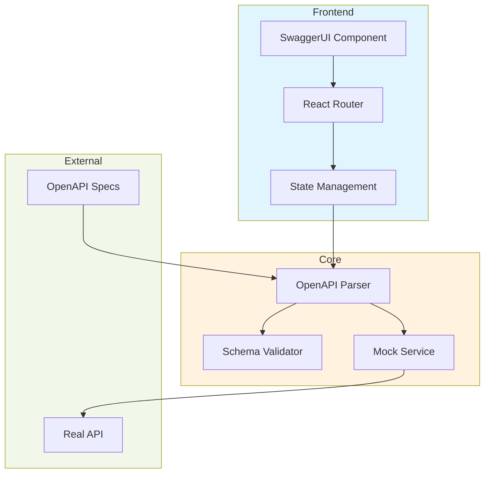
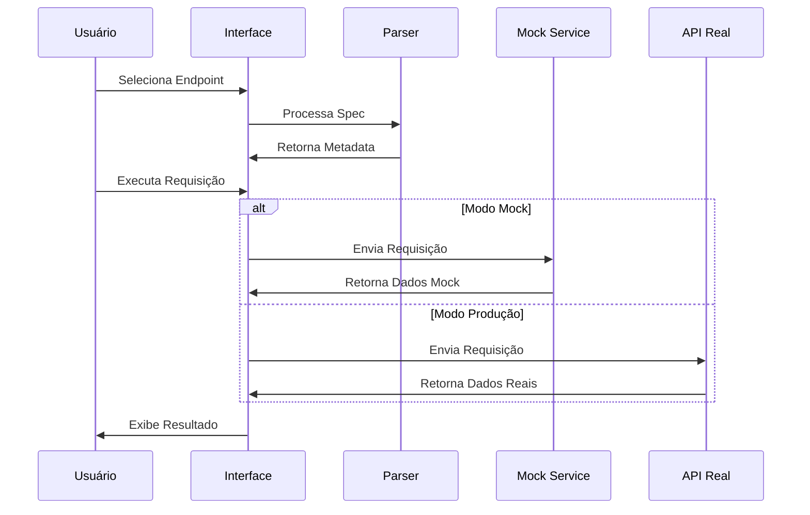
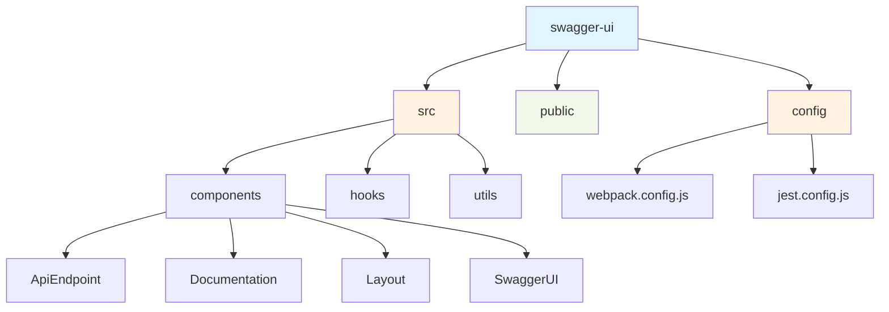
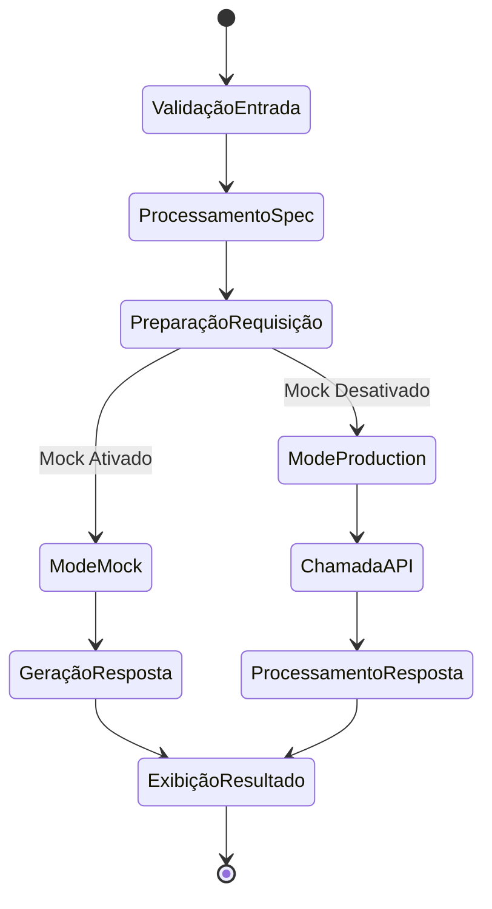
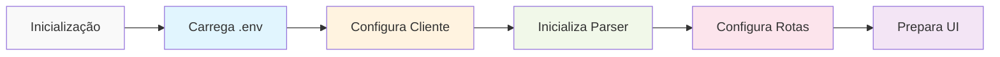
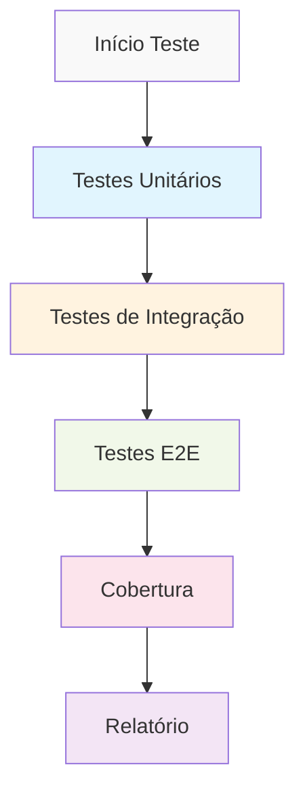
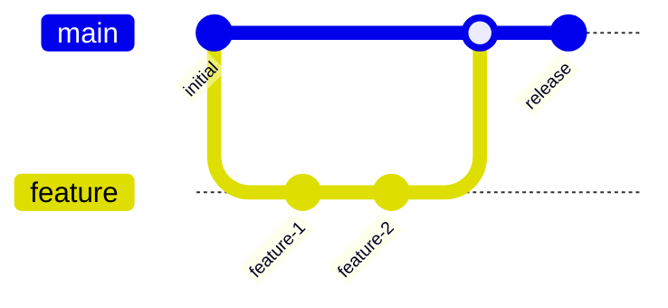
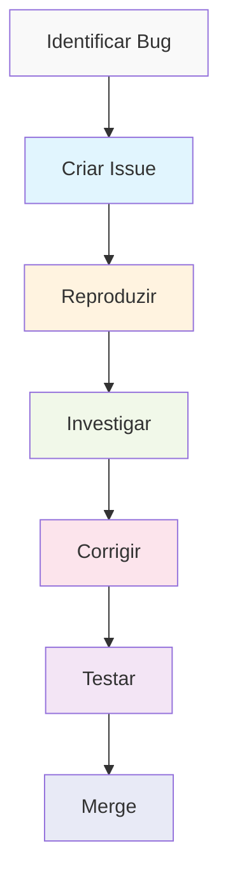

# swagger-ui


[](https://github.com/govinda777/swagger-ui/actions/workflows/deploy.yml)
[](https://github.com/govinda777/swagger-ui)
[](https://github.com/govinda777/swagger-ui)
[](https://webpack.js.org/)
[](https://reactjs.org/)
[](https://tailwindcss.com/)
[](https://jestjs.io/)
[](https://govinda777.github.io/swagger-ui)
[](https://nodejs.org)
[](https://github.com/govinda777/swagger-ui/blob/main/LICENSE)
[](http://makeapullrequest.com)
[](https://codeclimate.com/github/govinda777/swagger-ui)
[](https://snyk.io/test/github/govinda777/swagger-ui)
[](https://conventionalcommits.org)

# Swagger UI Documentation Viewer

Uma aplicação React moderna para visualização e teste de APIs através de documentação Swagger/OpenAPI.

## 📊 Arquitetura do Sistema



## 🔄 Fluxo de Requisições



## 📁 Estrutura do Projeto



## 🚀 Funcionalidades

- 📚 Visualização interativa de documentação Swagger/OpenAPI
- 🔍 Exploração de endpoints da API
- 🧪 Interface para testar chamadas à API
- 📱 Design responsivo
- 🎨 Interface moderna com Tailwind CSS
- 🔄 Simulação de chamadas à API com dados mock
- 🌐 Suporte a múltiplos formatos de especificação OpenAPI
- 🔒 Suporte a autenticação e autorização
- 📊 Visualização de esquemas de dados

## 🔄 Ciclo de Vida da Requisição



## 📋 Pré-requisitos

- Node.js (versão 14 ou superior)
- npm (gerenciador de pacotes do Node.js)

## 🛠️ Instalação

1. Clone o repositório:
```bash
git clone https://github.com/govinda777/swagger-ui.git
cd swagger-ui
```

2. Instale as dependências:
```bash
npm install -g serve --registry=https://registry.npmjs.org/
npm install --registry=https://registry.npmjs.org/
npm install --save-dev @babel/preset-react @babel/preset-env --registry=https://registry.npmjs.org/
```

3. Inicie o servidor de desenvolvimento:
```bash
npm start
```

## 🔧 Configuração

### Fluxo de Configuração



### Configuração da API

```javascript
export const swaggerSpec = {
  openapi: "3.0.0",
  info: {
    title: "Sua API",
    version: "1.0.0",
    description: "Descrição da sua API"
  },
  servers: [
    {
      url: "https://api.exemplo.com",
      description: "Servidor de Produção"
    }
  ],
  paths: {
    // Seus endpoints aqui
  }
};
```

## 🎨 Personalização do Estilo

```javascript
module.exports = {
  theme: {
    extend: {
      colors: {
        primary: {
          light: '#4FD1C5',
          DEFAULT: '#38B2AC',
          dark: '#319795',
        },
      },
      fontFamily: {
        sans: ['Inter', 'sans-serif'],
      },
    },
  },
  plugins: [
    require('@tailwindcss/forms'),
    require('@tailwindcss/typography'),
  ],
};
```

## 📝 Scripts Disponíveis

- `npm start`: Inicia o servidor de desenvolvimento
- `npm run build`: Cria uma build de produção
- `npm test`: Executa os testes
- `npm run lint`: Verifica o código com ESLint
- `npm run format`: Formata o código com Prettier

## 🧪 Processo de Teste



Execute os testes com:

```bash
npm test
```

Para cobertura de testes:

```bash
npm test -- --coverage
```

## 🤝 Fluxo de Contribuição



1. Faça um fork do projeto
2. Crie sua branch de feature (`git checkout -b feature/AmazingFeature`)
3. Commit suas mudanças (`git commit -m 'Add: nova funcionalidade incrível'`)
4. Push para a branch (`git push origin feature/AmazingFeature`)
5. Abra um Pull Request

## 📄 Licença

Este projeto está sob a licença MIT. Veja o arquivo [LICENSE](LICENSE) para mais detalhes.

## ✨ Exemplos

### Configuração Básica

```javascript
import SwaggerUI from './components/SwaggerUI';

function App() {
  return (
    <SwaggerUI 
      spec={swaggerSpec}
      options={{
        deepLinking: true,
        defaultModelsExpandDepth: 1,
        defaultModelExpandDepth: 1,
      }}
    />
  );
}
```

### Uso com Autenticação

```javascript
<SwaggerUI 
  spec={swaggerSpec}
  authConfig={{
    type: 'bearer',
    token: 'seu-token-aqui'
  }}
/>
```

## 🐛 Processo de Report de Bugs



Ao reportar um bug, inclua:

1. Como reproduzir o problema
2. O que era esperado
3. O que aconteceu
4. Screenshots (se aplicável)
5. Ambiente (navegador, OS, etc)

## Arquitetura do Projeto

- **App.js**: Componente principal da aplicação que renderiza o componente `SwaggerUI`.
- **SwaggerUI.js**: Componente responsável por renderizar a interface do Swagger.

### Configuração do Webpack

A aplicação utiliza três arquivos de configuração do Webpack:

- **webpack.common.js**: Contém a configuração comum usada tanto em desenvolvimento quanto em produção.
- **webpack.dev.js**: Configuração específica para o ambiente de desenvolvimento.
- **webpack.prod.js**: Configuração específica para o ambiente de produção.

### Scripts do NPM

- **start**: Inicia o servidor de desenvolvimento.
- **build**: Gera o build de produção.
- **test**: Executa os testes unitários com cobertura.
- **predeploy**: Gera o build de produção antes do deploy.
- **deploy**: Faz o deploy da aplicação para o GitHub Pages.

### Testes

Os testes são escritos utilizando o Jest e o React Testing Library. Os arquivos de teste estão localizados no mesmo diretório dos componentes que eles testam e seguem o padrão `*.test.js`.

### Estilo

A aplicação utiliza o Tailwind CSS para estilização. Os estilos são processados pelo PostCSS através do `postcss-loader` no Webpack.

### Deploy

O deploy da aplicação é feito automaticamente para o GitHub Pages utilizando o GitHub Actions. O workflow de deploy está configurado no arquivo `.github/workflows/deploy.yml`.

Para suporte, entre em contato através das issues do GitHub ou envie um email para [seu-email@exemplo.com]

## How to `deploy local`?

```bash
chmod +x local-deploy.sh
```

## 📞 Suporte

Para suporte, entre em contato através das issues do GitHub ou envie um email para [seu-email@exemplo.com]